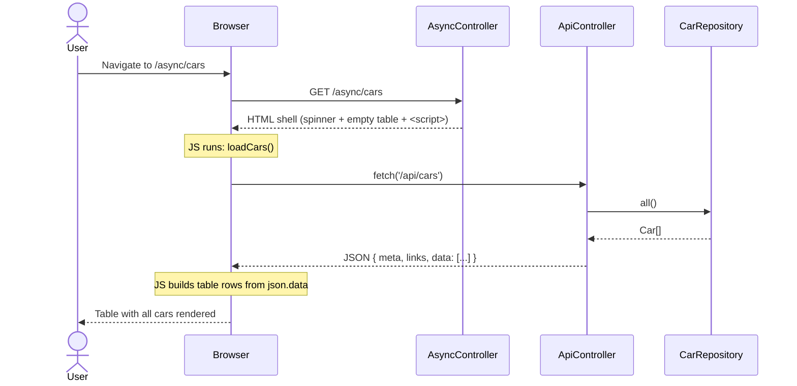
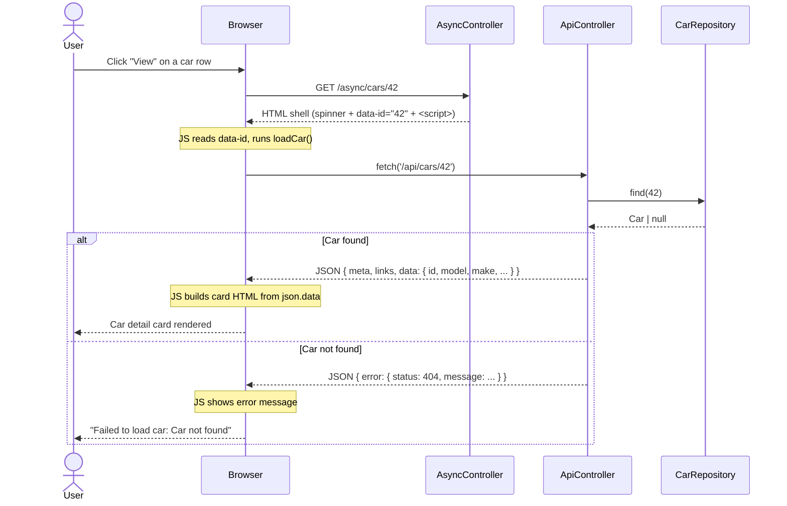

# Async JS Pages

This guide explains the alternative frontend added under `/async/cars`. Instead of the server rendering the car data into HTML (as the existing `/cars` pages do), these pages are thin HTML shells — the browser loads them, then JavaScript uses `fetch` with `async`/`await` to request data from the existing API and renders it into the DOM.

The `ApiController` already exists and is unchanged. The only new backend piece is `AsyncController`, which serves the HTML shell pages. All data fetching happens client-side.

---

## What was added

| File | Purpose |
|------|---------|
| `app/Controllers/AsyncController.php` | Serves the HTML shell pages |
| `app/views/async/index.html.twig` | Shell for the car list — JS fetches `/api/cars` |
| `app/views/async/show.html.twig` | Shell for a single car — JS fetches `/api/cars/{id}` |
| `app/RouteProvider.php` | Two new routes: `GET /async/cars` and `GET /async/cars/{id}` |
| `app/ServiceProvider.php` | Registers `AsyncController` in the DI container |
| `app/views/partials/base.html.twig` | Added "Async JS" nav link |

---

## Flow: `/async/cars` (car list)



---

## Flow: `/async/cars/{id}` (single car)



---

## How the JavaScript works

Both views follow the same three-step pattern:

```js
async function loadCars() {
    const response = await fetch('/api/cars');   // 1. make the request
    const json = await response.json();          // 2. parse the JSON body
    // 3. use json.data to build and insert HTML
}

loadCars();
```

The `await` keyword pauses execution until the `Promise` resolves, keeping the code readable without nested callbacks. Errors are caught with a `try/catch` block, which hides the spinner and shows an error message instead.

For the single car page, the car ID is passed from the server into the page via a `data-` attribute on a hidden element:

```twig
{# In show.html.twig — Twig embeds the ID at render time #}
<div id="car-id" data-id="{{ id }}"></div>
```

```js
// JS reads it back at runtime
const id = document.getElementById('car-id').dataset.id;
const response = await fetch('/api/cars/' + id);
```

This avoids hardcoding the ID in JavaScript or making an extra round-trip to discover it.
