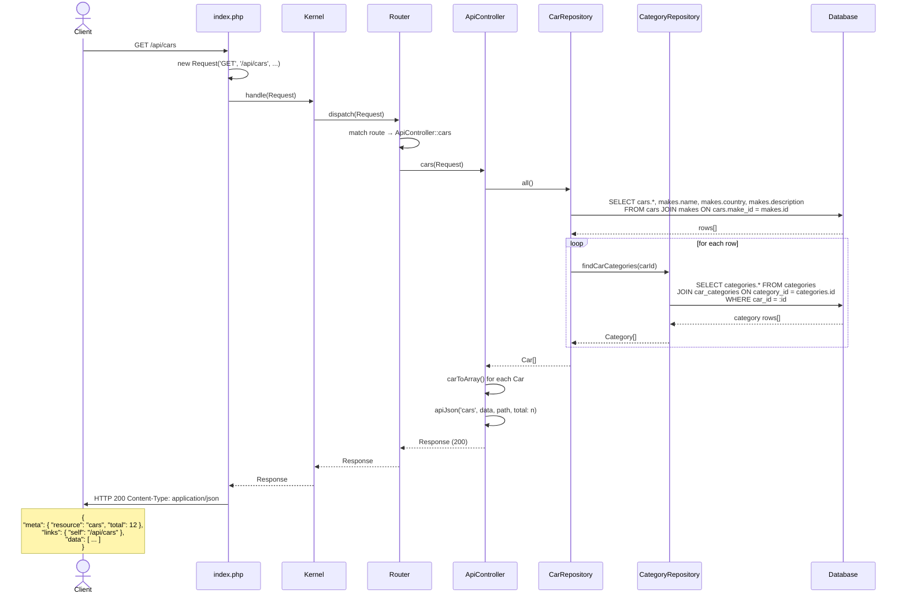
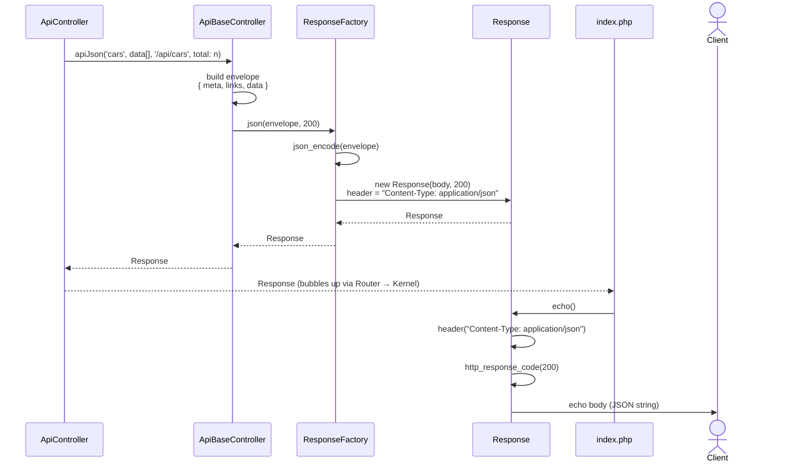

# Request diagrams

## GET /api/cars

A client requests the full list of cars. The request travels through the framework layer by layer, triggers two types of database queries, and returns a JSON envelope.



### How `ResponseFactory::json()` fits in

This diagram zooms in on the response-building steps — from the moment `ApiController` has its data ready to the moment the HTTP response is sent.



**Key responsibilities per layer:**

| Layer | Responsibility |
|---|---|
| `ApiBaseController::apiJson()` | Builds the `meta` / `links` / `data` envelope |
| `ResponseFactory::json()` | Encodes to JSON, sets `Content-Type`, creates the `Response` object |
| `Response::echo()` | Sends headers and body to the HTTP client |

### Notes

- The `JOIN` on the `makes` table is done in the same query as `cars`, avoiding a separate lookup per car.
- Categories are fetched in a second query **per car** inside `fromDbRow()`. This is an N+1 pattern — something to be aware of when the dataset grows.
- `apiJson()` is defined in `ApiBaseController` and wraps the payload in the `meta` / `links` / `data` envelope before handing it to `ResponseFactory`.

---

## Patterns explained

### The Repository

The Repository is responsible for one thing: **getting data in and out of the database**. It speaks SQL and returns PHP objects — nothing else. It has no knowledge of HTTP, JSON, or how the data will be used.

```text
CarRepository::all()   →  Car[]
CarRepository::find(1) →  Car
CarRepository::insert(Car) →  Car
```

This separation exists so that the rest of the application never has to write a SQL query. If you later switch from SQLite to MySQL, or want to load cars from a file instead of a database, you only change the repository. Nothing else in the application needs to know.

The interface (`CarRepositoryInterface`) makes this explicit: the controller depends on the interface, not the concrete class. This is the **Dependency Inversion Principle** — high-level code (the controller) does not depend on low-level details (PDO, SQLite).

### The Controller

The Controller sits between the HTTP request and the data layer. It receives a `Request`, asks the repository for data, and returns a `Response`. It does not write SQL and does not know how the data is stored.

For an API controller, the job is:

1. Extract input from the request (route parameters, query string)
2. Call the appropriate repository method
3. Decide what the response looks like (200 with data, 404 with error)
4. Return a `Response`

A single controller method is intentionally small. If a method grows beyond a few lines, that is usually a sign that logic belongs elsewhere — in the repository, a model, or a dedicated service.

### The role of `apiJson()`

`apiJson()` is defined in `ApiBaseController` and has one responsibility: **wrap any payload in a consistent envelope**.

```php
protected function apiJson(string $resource, mixed $data, string $selfLink, ...): Response
```

Without it, every controller method would have to manually construct the `meta`, `links`, and `data` keys. That means every developer has to remember the structure, and any mistake produces an inconsistent response. By centralising it in the base class, the envelope becomes a contract — the shape of every API response is guaranteed to be identical, regardless of which resource or which developer wrote the endpoint.

This is why `ApiController` calls:

```php
return $this->apiJson('cars', $data, $request->path, total: count($data));
```

instead of building the array by hand. The controller decides *what* to return; the base class decides *how* to format it.
